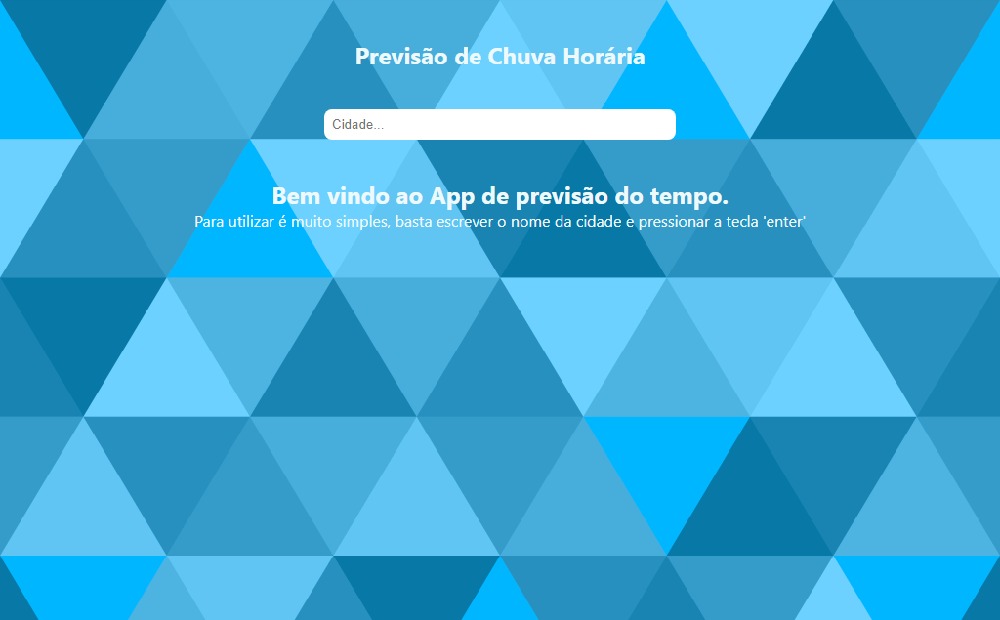
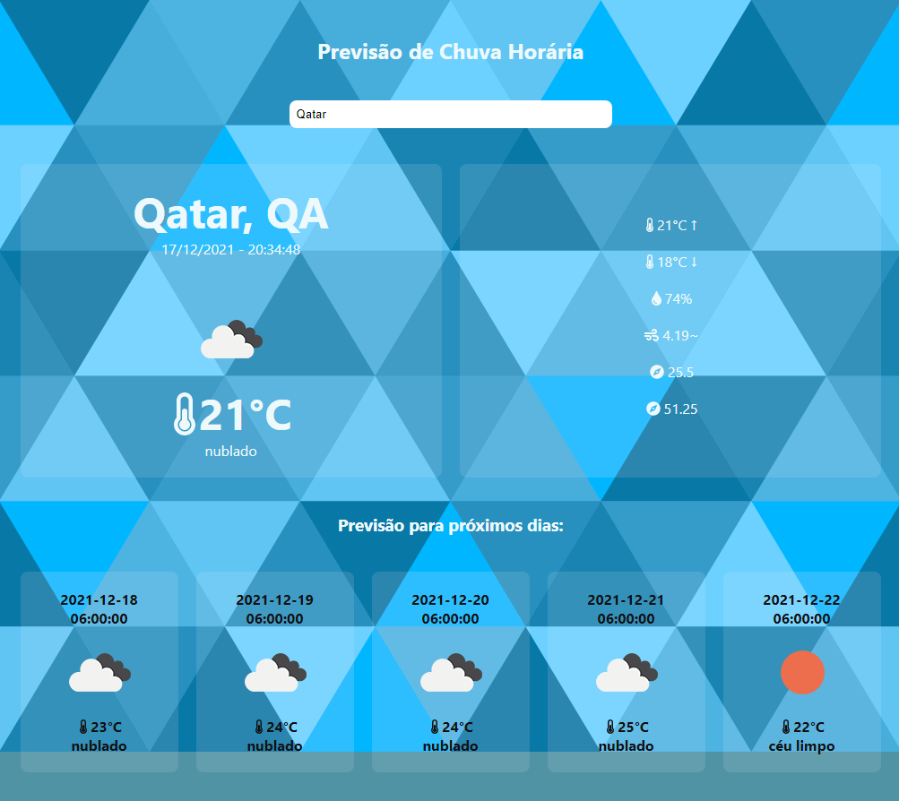
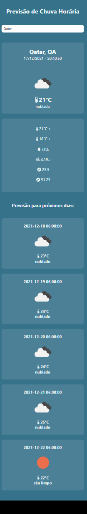

# Previsão de Chuva Horária-app - criado utilizando ReactJS
Aplicação para visualizar dados climáticos das cidades.

A aplicação consome duas API's da [Open Weather Map](https://openweathermap.org/)
- 1ª API: https://openweathermap.org/current  (Para receber os dados atuais)
- 2ª API: https://openweathermap.org/forecast5  (Para receber os dados de previsão dos próximos 5 dias)

**
 DESKTOP 
**

  

 
 

**
 MOBILE 
**

## 👷 Execução e demais configurações

Para iniciar a aplicação, rode o comando:

    yarn start

Referente as demais configurações, para efeito de testes, de quem desejar baixar o repositório:

É necessário criar um cadastro na [Open Weather Map](https://openweathermap.org/) para gerar uma API KEY, porém deixei o projeto já configurado com as KEYS que criei, é interessante se cadastrar lá, gerar a própria API KEY.

    API KEY gratuita com limite de 60 requisições/minuto e 1.000,000 requisições/mês

- Link para se cadastrar:
- https://home.openweathermap.org/users/sign_up

- Link para gerar API KEY (depois de ter se cadastrado e confirmado em seu e-mail):
- https://home.openweathermap.org/api_keys

## 👷 Substituindo a API KEY que deixei no projeto pela gerada por ti:

Vá até o arquivo **api.js** o mesmo está dentro da pasta **src/app/services**

**src/app/services/api.js**
